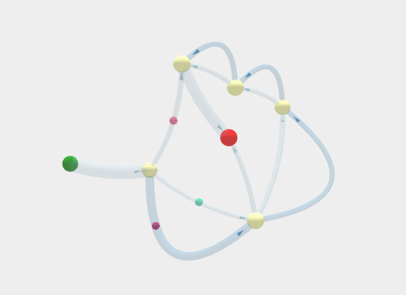
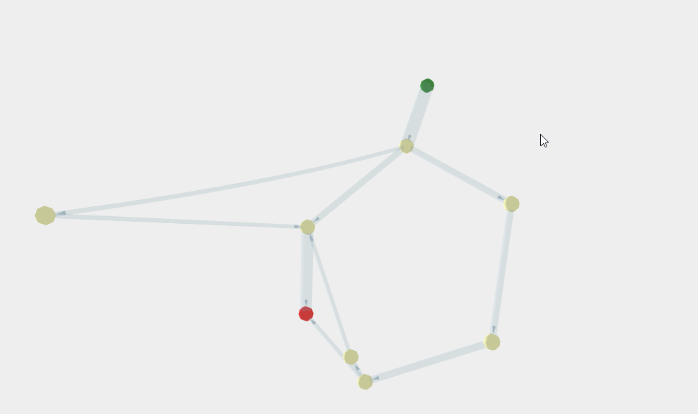
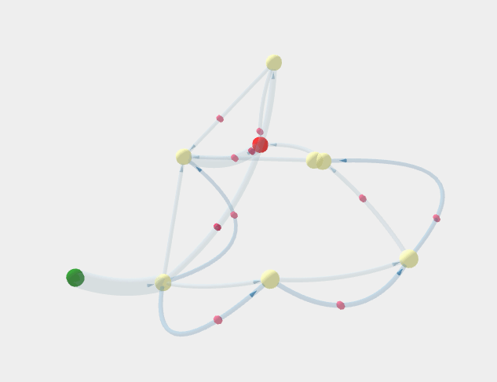

# masterthesis

## Table Of Contents

- [masterthesis](#masterthesis)
  - [Table Of Contents](#table-of-contents)
  - [What is 3D - Process Map?](#what-is-3d---process-map)
  - [Events Logs](#events-logs)
  - [Examples](#examples)
  - [Libraries](#libraries)

***

## What is 3D - Process Map?
3D - Process Map is a master project to experiment with 3D visualization to show network diagrams in process mining to show data characterstics like waiting time.<br>


<br>
***
## Events Logs
The Event logs used in visualization are within ```./example logs``` directory.
***

## Examples
<br>
<br>

***

## Libraries
This project is based on  [3D FORCE GRAPH](https://github.com/vasturiano/3d-force-graph), D3.JS and Require.js library.

***
This project is done by Hridaya Sagar Subedi under a supervision of Felix Mannhardt.